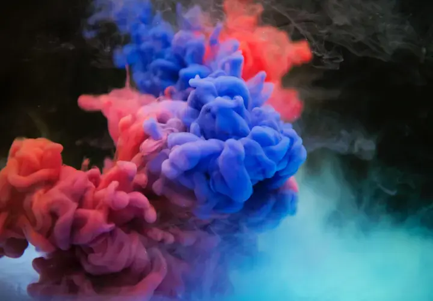

## Who we are

We would like to welcome you to Nectbox! We are a passionate team of developers that enjoy working with incredible people and bring their ideas to reality.

Nectbox has been created with the sole purpose of user-driven product development, we felt too many companies around the web focus too much on the solution they provide instead of focusing on the problem that the customer has. At Nectbox we **do not** just do things to get them done, we do things to provide value for our customers and our solutions are tailored according to our custumers needs and not the other way around.

## What we believe

One of the most important factors to us was building the open company and culture that we’ve always wanted. We discussed our goals on every level from family to community involvement to how we believe we should work together internally and with our clients. We love doing things we’re passionate about with people who are passionate about what they do.

Passion alone isn’t enough; we believe in trust, transparency, and close knit collaboration. We strive to help our clients create the right products to solve the right problems through customer feedback and iteration. We hope to create an exponential impact on our community, both online and offline.

With our focus set, we’ve created a new brand that truly reflects our approach to projects as well as our overall strategy & goals.

## Introducing Nectbox

We’re so excited to be continuing our journey as Headway.

We believe that making progress through more scientific and data-driven processes like validated learning and iterative development creates the best environment for successful projects. With this in mind, Headway, synonymous with progress, aims to communicate our methodologies. The wave in our logo is a single wavelength cycle that represents our sprint and agile based approach.

## Services we are offering

We’re focused on what we do best, where we can use our expertise end experience to create the most value.

Our services include UX/UI Design, Web & Mobile Application Development and Training.

Some examples of projects we’re currently taking on include:

- Product Design Sprints
- Prototypes for Collecting Customer Feedback
- Creating an MVP
- Filling a gap until an internal team is hired
- Staff Augmentation with existing internal team
- Maintenance Retainers
- Company Training
- Design & Development Workshops

## Thanks for joining us!

We’d love to hear your thoughts on our branding, direction, and would love to discuss a solution that’s going to help automate and create value for your startup or company.
